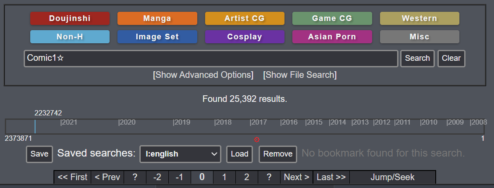

# EH-Page-Scrobbler

Original script from [FabulousCupcake](https://gist.github.com/FabulousCupcake/df9cf78da90e3a4bb83ae42848983dcd), modified by [OceanS2000](https://gist.github.com/OceanS2000/0849a0582cfae4b4771958944883b4df) and [Qserty](https://pastebin.com/pWrA6ihD) !

Script to enhance the search experience with e?hentai sites.

## Installation

1. First you need a Browser Extension for managing UserScripts (skip if you already have one):  
   * Chrome: [Violentmonkey](https://chrome.google.com/webstore/detail/violentmonkey/jinjaccalgkegednnccohejagnlnfdag) or [Tampermonkey](https://chrome.google.com/webstore/detail/tampermonkey/dhdgffkkebhmkfjojejmpbldmpobfkfo)
   * Firefox: [Violentmonkey](https://addons.mozilla.org/en-US/firefox/addon/violentmonkey/), [Tampermonkey](https://addons.mozilla.org/en-US/firefox/addon/tampermonkey/) or [Greasemonkey](https://addons.mozilla.org/en-US/firefox/addon/greasemonkey/) 
   * Opera: [Tampermonkey](https://addons.opera.com/en/extensions/details/tampermonkey-beta/)
   * Brave: [Violentmonkey](https://chrome.google.com/webstore/detail/violentmonkey/jinjaccalgkegednnccohejagnlnfdag) or [Tampermonkey](https://chrome.google.com/webstore/detail/tampermonkey/dhdgffkkebhmkfjojejmpbldmpobfkfo)
   * Edge: [Violentmonkey](https://microsoftedge.microsoft.com/addons/detail/violentmonkey/eeagobfjdenkkddmbclomhiblgggliao) or [Tampermonkey](https://microsoftedge.microsoft.com/addons/detail/tampermonkey/iikmkjmpaadaobahmlepeloendndfphd)  
    
2. Install script from [it's page](https://raw.githubusercontent.com/Meldo-Megimi/EH-Page-Scrobbler/main/PageScrobbler.user.js)
